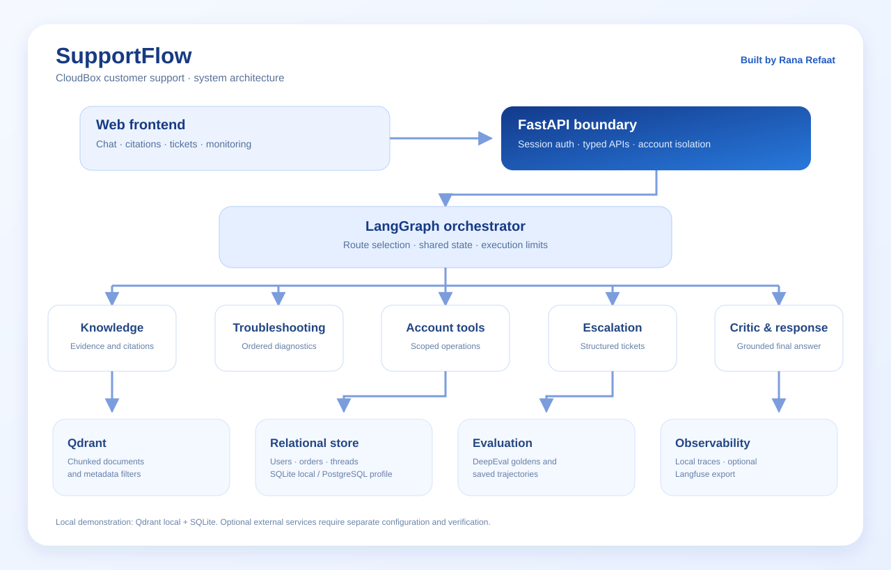

# SupportFlow — CloudBox support capstone

A FastAPI + LangGraph support service with five specialized nodes, authenticated account isolation, Qdrant retrieval, relational persistence, a React frontend, real-graph DeepEval evaluations, and optional Langfuse export.

**Read `START_HERE_MASRI.md` first for the Egyptian Arabic explanation.**

## What SupportFlow does

SupportFlow brings documented answers, troubleshooting, account operations and secure escalation into a single support experience:

- A LangGraph orchestrator routes requests through five specialized agents and records a bounded execution trajectory.
- Qdrant retrieves versioned CloudBox documentation with readable citations and source metadata.
- FastAPI validates session identity, checks account ownership and exposes typed chat, thread, document, feedback, evaluation and ticket endpoints.
- The React interface displays conversations, sources, tool events, escalation tickets and local monitoring.
- The evaluation suite runs the supplied goldens and additional edge cases against the compiled graph, saving outputs and trajectories.

**Local profile:** SQLite for relational data, Qdrant local storage, lexical hash embeddings and evidence-based extractive answers. The repository also includes a Docker profile for PostgreSQL and server Qdrant, plus optional model, semantic embedding and Langfuse integrations. Configuration and validation for external services are described in `docs/VALIDATION.md` and `docs/MONITORING.md`.

**Author:** Rana Refaat. Start with `QUICKSTART_WINDOWS.md` for the local demo, or `START_HERE_MASRI.md` for an Egyptian Arabic walkthrough.

## Demo video

[Watch the SupportFlow walkthrough on Google Drive](https://drive.google.com/drive/folders/1ajC0XgC80uWst_hd_JtckLmp_8fYthHm?usp=sharing)

## Architecture diagram



Open the SVG directly in a browser for a full-size diagram.

## Quick start — Windows, one ZIP and no npm

Open **`QUICKSTART_WINDOWS.md`** and use the four numbered `.cmd` files in the project folder. The prebuilt blue frontend, including “Built by Rana Refaat”, is already included in this archive. Python 3.12 is required. The Windows setup installs `requirements-windows.txt`, which installs the local backend without requiring a native frontend build.

The local setup generates a private `.env` with a random JWT secret, uses local Qdrant and SQLite, and does not need API keys. Run **one backend process at a time** because embedded Qdrant locks its data folder.

The demo token is valid for one hour; generate a new one with `4_GET_TOKEN.cmd` when needed. The UI URL is **http://127.0.0.1:5173**; the API health URL is **http://127.0.0.1:8000/health**.

### Optional Windows PowerShell commands

From the folder containing this README, run once:

```powershell
python -m venv .venv
.\.venv\Scripts\python.exe -m pip install -r requirements-windows.txt
.\.venv\Scripts\python.exe -m scripts.setup_local
```

Terminal 1: `.\.venv\Scripts\python.exe -m uvicorn app.main:app --host 127.0.0.1 --port 8000 --no-access-log`

Terminal 2: `.\.venv\Scripts\python.exe -m http.server 5173 --bind 127.0.0.1 -d frontend/dist`

Terminal 3: `.\.venv\Scripts\python.exe -m scripts.issue_token user_1`

The dev token is private and must not appear in a recording or repository. The local CLI stands in for a real identity provider.

### Linux/macOS

```bash
python3.12 -m venv .venv
.venv/bin/python -m pip install -r requirements.txt
.venv/bin/python -m scripts.setup_local
.venv/bin/python -m scripts.issue_token user_1
.venv/bin/python -m uvicorn app.main:app --host 127.0.0.1 --port 8000 --no-access-log
```

Run `npm ci && npm run dev` in `frontend/` from a second terminal.

## Fictional sessions

| Subject | Account | Private-account verification | Role |
|---|---|---|---|
| `user_1` | `acc_1001` | Verified | User |
| `user_2` | `acc_1002` | Not verified | User |
| `user_3` | `acc_1003` | Verified | User |
| `admin` | `acc_1001` | Verified | Administrator |

These mappings are server-side database records. Editing a chat message, a frontend field, or token claims cannot change the mapping. Use `scripts.issue_token admin` for document ingestion. User 2 is intentionally blocked from private account/order reads until verification occurs through a secure identity flow; the application never asks for an OTP in chat.

## PostgreSQL + Qdrant server with Docker

Create `.env` using the setup command above, install Docker Desktop, and run:

```powershell
docker compose up --build -d
docker compose exec backend python -m scripts.issue_token user_1
```

Open http://localhost:5173. Containers use PostgreSQL and Qdrant over an internal network. Database ports are not published. The API and frontend bind to loopback by default. Named volumes retain database records, vectors and trace files.

```powershell
docker compose restart
```

After restarting, reuse an unexpired token or issue a fresh one and check the same thread and indexed documents. **Do not use `docker compose down -v` when demonstrating persistence: it deletes named volumes.**

Only one backend worker is supported in the reference deployment. Qdrant local mode cannot share its files between independent processes. Stop the local backend before running `scripts.ingest`; or use the server deployment and administrator ingestion endpoint.

## Tests and evaluation

```powershell
$env:PYTEST_DISABLE_PLUGIN_AUTOLOAD="1"
.\.venv\Scripts\python.exe -m pytest -q
.\.venv\Scripts\python.exe -m scripts.offline_eval artifacts/new_run
.\.venv\Scripts\python.exe -m ruff check app scripts tests evals
.\.venv\Scripts\python.exe -m ruff format --check app scripts tests evals
cd frontend
npm run build
```

The offline evaluator blocks outbound Python sockets before importing DeepEval. It executes `Service.chat` → the same compiled graph used by the API in temporary isolated stores. It runs the original 20 goldens and 12 added cases. Reports contain actual answers, tool events, citations, checks and multi-turn trajectories. Failure injection occurs in the real tool layer; it does not replace the graph.

To evaluate semantic quality with an LLM judge, configure a judge provider locally (DeepEval uses `OPENAI_API_KEY` for its default judge) and run:

```powershell
.\.venv\Scripts\python.exe -m evals.run --judge --output artifacts/judged_run
```

This sends the fictional evaluation prompts and outputs to your selected judge provider and may incur cost. `--mode llm` also exercises the configured response model. A structural pass is not a substitute for this run. Do not use the offline runner when you intentionally want a remote model.

## Optional LLM and semantic embeddings

Edit `.env` on your own computer. Do not paste keys into chat or the frontend.

```dotenv
MODEL_MODE=llm
LLM_BASE_URL=https://api.openai.com/v1
LLM_API_KEY=your_private_key
LLM_MODEL=your_provider_model_id
```

The model selects complete excerpts from retrieved evidence and returns structured JSON. The critic verifies exact membership. It cannot invent tools, choose an account, authorize a refund, or modify a ticket scope. Maximum one response-model request per graph invocation, 15-second timeout, zero retries. Failures revert to extractive evidence.

Optional semantic embedding API:

```dotenv
EMBEDDING_MODE=api
EMBEDDING_BASE_URL=https://api.openai.com/v1
EMBEDDING_API_KEY=your_private_key
EMBEDDING_MODEL=text-embedding-3-small
EMBEDDING_DIMENSIONS=1536
```

Choose compatible model/dimensions for your provider. This uses a separate collection and reindexes relationally stored documents on first startup in that mode. Default `hash` uses stable 4096-dimensional lexical word/bigram vectors; **it is not a semantic sentence-transformer model**. Treat its scores as similarity values, not calibrated confidence. Calibrate `RETRIEVAL_THRESHOLD` separately for API embeddings. Live provider validation remains outstanding.

## Monitoring and current service status

Set `LANGFUSE_PUBLIC_KEY`, `LANGFUSE_SECRET_KEY`, and `LANGFUSE_BASE_URL`, restart the API, then follow `docs/MONITORING.md`. One request maps to one trace; thread IDs group sessions. Local traces are always written under `runtime/traces`. Export attempts are not falsely labelled confirmed delivery.

For a real status provider, set the server-owned `STATUS_URL` to an endpoint returning:

```json
{"status":"degraded","message":"File previews are degraded; investigation is in progress.","observed_at":"2026-09-24T12:00:00Z"}
```

Allowed statuses: `operational`, `degraded`, `outage`, `unknown`. The example is a **schema example**, not a real CloudBox incident. With no URL the tool explicitly says current availability is unknown. Historical incident documents are never used to claim a live incident.

## Main files

| Path | Responsibility |
|---|---|
| `app/main.py`, `schemas.py` | Nine required API endpoints, plus thread listing and monitoring |
| `app/security.py` | JWT validation, session-derived scope, conservative disclosure suppression |
| `app/graph.py` | Orchestrator, five subagents, routing and bounded graph |
| `app/tools.py` | Six typed tools with structured error envelopes |
| `app/rag.py` | Metadata ingestion, atomic chunking, embeddings, filters, version precedence |
| `app/db.py` | SQLAlchemy relational models and owner-scoped queries |
| `app/telemetry.py` | Local spans and best-effort Langfuse export |
| `app/model.py` | Optional bounded model evidence selection |
| `evals/` | Original goldens, added edge cases, DeepEval metric and runner |
| `frontend/` | React/Vite UI; backend API calls only |
| `docs/` | Architecture, security boundaries, validation and deployment notes |
| `demo/` | 7–10 minute recording sequence and English speaking script |

## Troubleshooting

- `No module named app`: run from the project root, not inside `app/` or `frontend/`.
- Qdrant “already accessed”: another process is using the same local vector folder. Stop it or use server Qdrant.
- 401: issue a fresh token; tokens expire after one hour.
- 403 on document ingestion: use the admin session. Normal users cannot establish official source documents.
- Browser API/CORS error: use `127.0.0.1:5173`; ensure API runs on port 8000. Add the exact Lovable origin to `CORS_ORIGINS` when deploying.
- No current outage state: configure `STATUS_URL`; the fallback deliberately refuses to invent one.
- SQLite works but Docker fails: Docker configuration is supplied, not verified here. Check `docker compose logs backend postgres qdrant` and image availability.

## Production boundaries

This is educational code using fictional records. Before internet deployment: use a real verified identity provider, TLS and a reverse proxy, rate limits, database migrations/backups, credential rotation, robust secret detection/DLP, multi-worker locking, reliable document indexing transactions, a calibrated semantic retriever, semantic evaluations, and confirmed monitoring delivery. Regex disclosure suppression is conservative and cannot establish that every possible unlabelled secret is detectable. Routing is English-focused and deterministic; arbitrary multilingual or adversarial phrasing needs additional evaluation.
