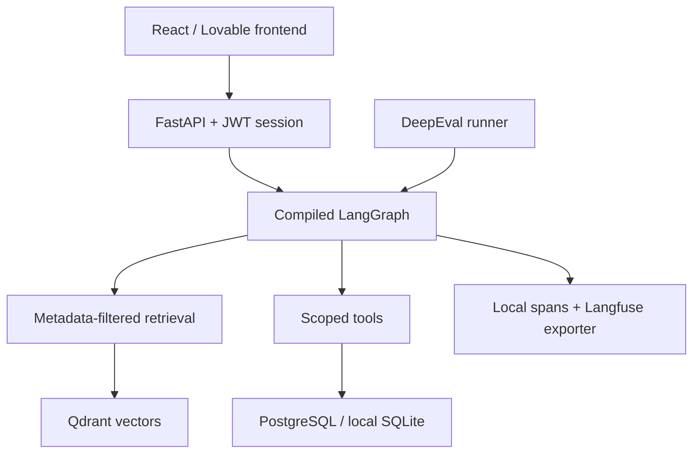
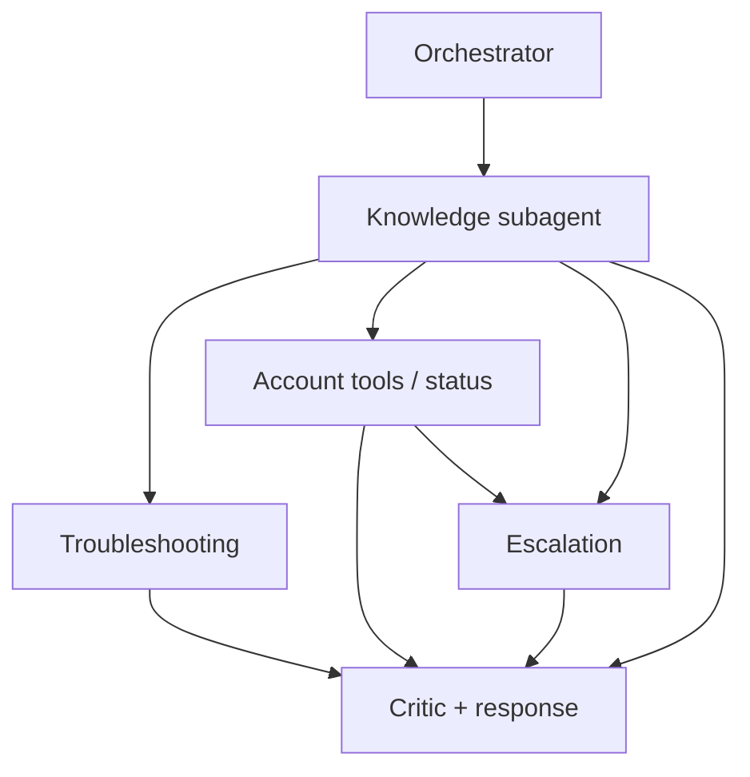

# Architecture and contracts

The frontend contains no model prompts, account authorization, retrieval logic, or agent execution. It issues authenticated API calls and renders returned evidence and activity. The backend has all authority.

## Shared state

`State` carries `user_id`, server-created `principal`, `thread_id`, `request_id`, sanitized `request`, resolved `query`, `route`, `filters`, `retrieved_context`, `evidence`, `tool_events`, `escalation_state`, `diagnostics`, `final_answer`, `trace_id`, `trajectory`, `model_calls`, `tool_calls`, `search_calls`, and `errors`.

The server checks thread ownership before invoking the graph. Thread context is read through the scoped summary tool and consists of the last three sanitized user messages. Only short context-dependent follow-ups incorporate previous turns. This is bounded conversation memory, not a global user profile and not a free-form model-written memory.

## Subagent contracts

| Node | Reads | Produces | Authority |
|---|---|---|---|
| Orchestrator | Sanitized request, current-user thread summary | Route and resolved query | No direct account reads |
| Knowledge | Query and metadata filters | Ranked chunks with source IDs, versions and scores | Bounded read-only search |
| Troubleshooting | Retrieved troubleshooting evidence, issue type | Applicable ordered atomic workflow | No destructive operations |
| Account tools | Session principal and requested identifiers | Account/order/status tool events | Ownership and verification checked inside tool layer |
| Escalation | Issue summary, thread, policy route | Structured ticket or structured failure | Current user and account only |
| Critic and response | Evidence and tool results | Supported excerpts, citations, safe next steps | Cannot authorize new tools or invent evidence |

These are specialized LangGraph nodes. Routing and tool authorization are deterministic; this implementation does not claim five independently autonomous LLMs. Optional LLM selection runs once in the final evidence path. This design prioritizes reproducible scope enforcement and testability over unconstrained autonomy.

## Bounds

- Graph recursion limit: 8 supersteps; acyclic route graph.
- Normal request: 3–5 named nodes.
- Maximum tool calls: 8; no tool retries.
- Search depth: 16 candidate vectors; at most 4 returned chunks per search.
- At most two search calls: main official evidence plus an internal access-policy lookup where needed.
- At most one generation request, 15-second timeout, no retries.
- Semantic embeddings: up to two query-embedding calls per graph run; indexing calls occur separately.
- Current status timeout: 4 seconds; Qdrant server timeout: 5 seconds.
- Chat input maximum: 4,000 characters; document input: 60,000 characters; atomic section: 12,000 characters.

## Retrieval

All six front-matter fields are preserved: `doc_id`, `title`, `product`, `version`, `source_type`, `trust_level`. Chunks are semantic Markdown sections. A table and an ordered procedure are not split; associated conditions stay together. Oversized sections are rejected with a structured validation error instead of silently truncating rules.

Qdrant stores vectors plus complete source metadata. Filters compose conjunctively. Default trust is official. Internal agent governance is separately retrieved and explicitly labelled internal; it is never presented as official CloudBox product documentation. Untrusted chunks cannot become final product evidence.

The latest official version within the same `doc_id` lineage supersedes older versions by numeric/date-like version ordering. A deliberate version filter can retrieve a historical version. Different document IDs require curated lineage/topic mapping for general conflict resolution; this remains a production constraint.

Default embedding mode is a transparent lexical baseline. API embeddings support a separately named collection keyed by model and dimensions. Changing embedding mode rebuilds an empty target collection from relational document records. Similarity scores are not probability estimates.

The final response copies complete retrieved paragraphs/procedures and provides readable titles/IDs/versions. Account amounts come only from the authenticated tool result and are labelled as tool evidence. Live status comes only from the status tool. A knowledge miss produces one focused question.

## Persistence and schema

SQLAlchemy models: users, accounts, orders, threads, messages, documents, feedback, tickets and request metrics. PostgreSQL is configured in Compose; SQLite is the local relational equivalent used for test execution. Ticket writes are idempotent within one graph request ID. Default startup uses `create_all` for a new educational database. `migrations/001_initial.sql` documents PostgreSQL DDL; schema evolution needs a real migration strategy before production.

All thread reads, feedback writes and order reads constrain the owner inside the database query. Tool exceptions produce a stable error envelope without exception text or stack traces in API responses. Documents can be ingested only by an authenticated administrator.

One process-wide lock serializes graph invocations in the reference implementation. Horizontal scaling, shared distributed locks and stronger transaction/outbox handling are outside the validated local configuration.
